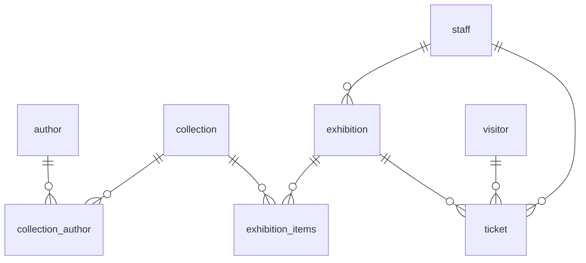

# Museum Database System 🎨🏛️

Relational database solution created for museum operations management, designed in **3rd Normal Form (3NF)** and implemented in **PostgreSQL**

---

## 📌 Project Overview

The database integrates core museum sectors:
* **Collection Management**: Tracks art items, creation years, estimated value, and storage locations.
* **Exhibitions & Curators**: Links curated on-site/online exhibitions with collection items.
* **Visitor Services & Sales**: Manages ticket sales across tiered visitor pricing (Standard, Discounted, Child).
* **Analytics & Security**: Automated sales revenue reporting per quarter and role-based read-only access control.

---

## 🗄️ Database Architecture

The system consists of **8 interconnected tables**:


* **Main Tables**: `author`, `collection`, `staff`, `visitor`, `exhibition`, `ticket`.
* **Junction Tables (M:N)**: `collection_author`, `exhibition_items`.

---

## 🛠️ Tech Features

* **Data Integrity**: Enforces custom `CHECK` constraints (date boundaries > 2026-01-01, non-negative prices, predefined enumerated types) and natural `UNIQUE` constraints.
* **PL/pgSQL Functions**:
  * `update_collection(...)` – Dynamic column update with internal type casting.
  * `add_ticket(...)` – Transaction function creating ticket entries via natural key lookups and dynamic pricing calculation.
* **Analytics View**: `sales_revenue` automatically groups ticket sales and totals for the latest recorded quarter.
* **Security Control**: `manager` role with read-only permissions (`SELECT`) created following the principle of least privilege.

---

## 📂 Repository Structure

```text
├── SQL_Greta_Tautaviciute_FinalTask_Museum_ConceptModel.png
├── SQL_Greta_Tautaviciute_FinalTask_Museum_LogicalModel.png
├── SQL_Greta_Tautaviciute_FinalTask_Museum_descriptions.docx
└── SQL_Greta_Tautaviciute_FinalTask_Museum_Scripts.sql
```

🚀 How to Run
Open PostgreSQL or DBeaver.

Execute SQL_Greta_Tautaviciute_FinalTask_Museum_Scripts.sql to build the schema, populate mock data, and set up functions, views, and roles.
